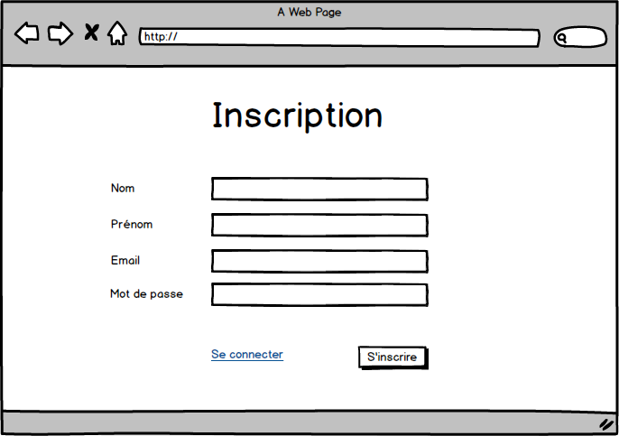
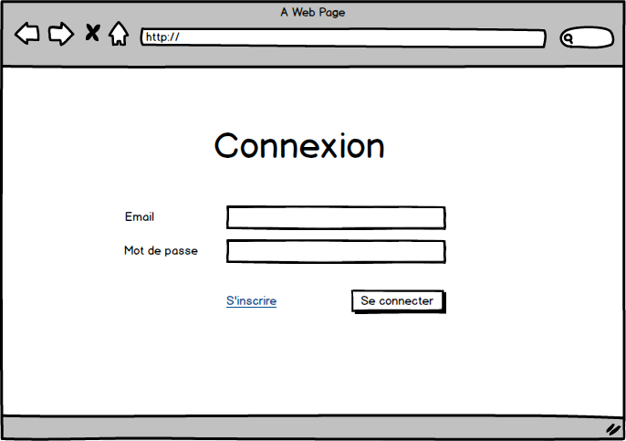
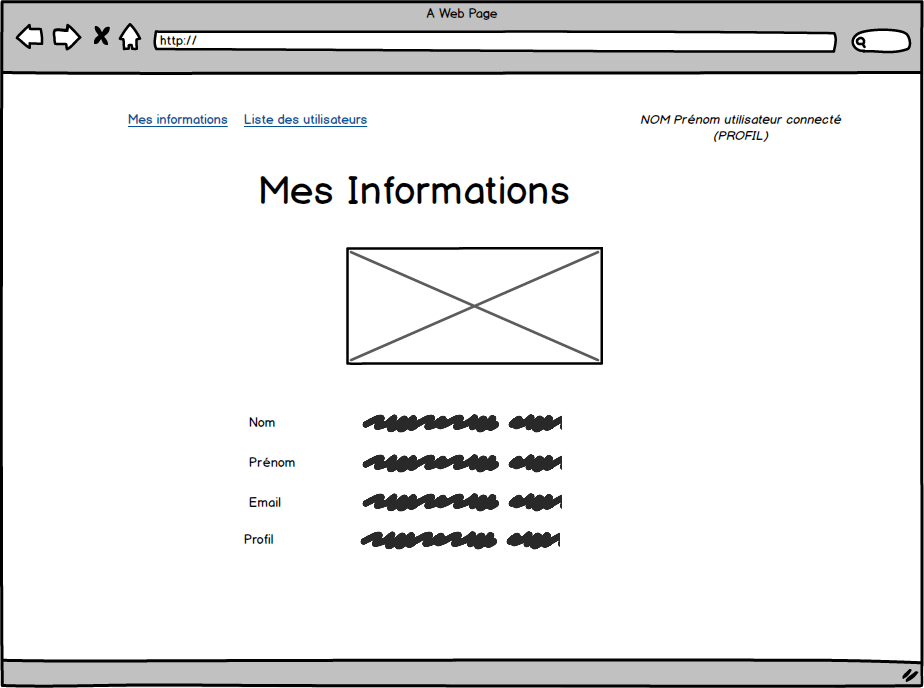
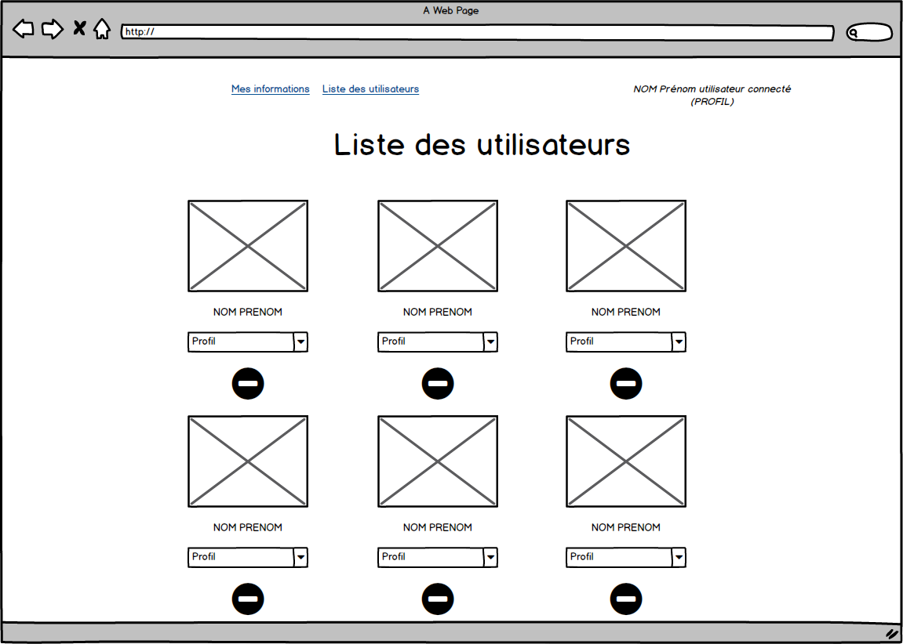

FURNARI Florian
# Mini-projet Spring Security

## Objectif

L'objectif de cet exercice est de valider la compréhension des concepts Spring Security à travers la mise en œuvre d'une application complète (front + back).

Le back sera une application Spring (avec Spring Security) avec un accès à une base de données relationnelle (MySQL, PostGreSQL, ...)

Le front peut être écrit avec la technologie de votre choix (JavaScript, React, Vue, Angular, ...).

> Je vous propose, dans un premier temps, de désactiver la configuration CSRF de Spring Security et vous en occuper en fin de projet.

## Mise en place

* Créer une branche à votre nom
* Créer un commit fictif et une pull request avec votre nom
* A chaque évolution, commiter, pusher et mettez à jour le label associé à votre étape

## Avancement

Veuillez cocher les cases ci-dessous pour notifier les pages qui fonctionnent dans votre projet.

* [ ] Page Inscription
* [ ] Page Connexion
* [ ] Page Mes informations
* [ ] Page Liste des utilisateurs
* [ ] Prévention CSRF

## Les pages

Un utilisateur peut avoir les rôles suivants :
* Utilisateur
* Gestionnaire
* Administrateur

L'application sera constituée de 4 pages :

### Page Inscription (accessible sans authentification). 

Le rôle "Utilisateur" est automatiquement affecté.

### Page Connexion (accessible sans authentification)

### Page Mes Informations (accessible uniquement à un utilisateur authentifié)

### Page Liste des utilisateurs (accessible uniquement à un utilisateur authentifié ayant le rôle de gestionnaire). 

* Le lien "Liste des utilisateurs" du menu est à griser si l'utilisateur n'est pas gestionnaire.
* Le bouton de suppression et la modification du profil ne sont accessibles que si l'utilisateur connecté est administrateur. 

